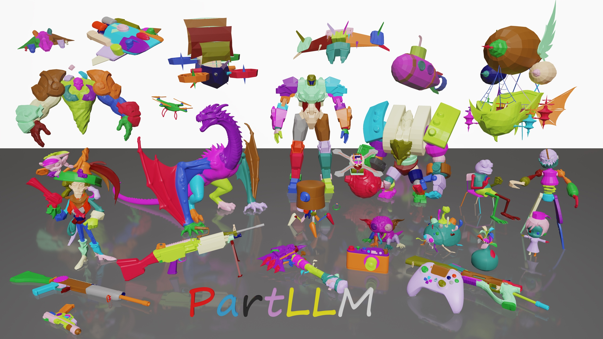
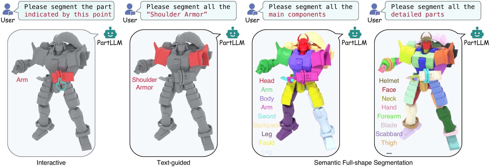

# PartLLM: A Unified Multimodal Foundation for 3D Part Segmentation

[Zhe Zhu](https://czvvd.github.io/homepage/),
[Yiheng Zhang](https://graphic-kiliani.github.io/homepage/),
Peng Li,
Zixing Zhao,
[Honghua Chen](https://chenhonghua.github.io/clay/),
Yaqing Zhang,
Le Wan,
[Zhiyang Dou](https://people.csail.mit.edu/frankzydou/),
[Cheng Lin](https://clinplayer.github.io/)<sup>‡</sup>,
[Yuan Liu](https://liuyuan-pal.github.io/)<sup>†</sup>,
[Mingqiang Wei](https://scholar.google.com/citations?user=TdrJj8MAAAAJ&hl=en)<sup>†</sup>,
[Wenping Wang](https://engineering.tamu.edu/cse/profiles/Wang-Wenping.html)

<sup>‡</sup> Project lead. <sup>†</sup> Corresponding authors.

**SIGGRAPH Asia 2026 (ACM Transactions on Graphics)**

<p align="center">
  <a href="https://czvvd.github.io/PartLLMPage/"></a>
  <a href="https://arxiv.org/abs/2609.25832"></a>
</p>



## Installation

```bash
conda create -n partllm python=3.11 -y
conda activate partllm
bash scripts/install.sh
```

Optionally install the vLLM backend; all inference modes will use it automatically:

```bash
bash scripts/install_vllm.sh
```

Download the released checkpoint from Hugging Face:

```bash
hf download Czvvd/PartLLM --local-dir ./checkpoints/partllm
export MODEL_PATH=$PWD/checkpoints/partllm
```

## Inference



PartLLM supports full-shape segmentation with controllable granularity, text-guided part segmentation from part names, and interactive segmentation from 3D point prompts within a single model.

```bash
# Full-shape segmentation
bash scripts/infer.sh full_shape "$MODEL_PATH" /path/to/meshes outputs/full_shape

# Text-guided part segmentation
bash scripts/infer.sh text_guided "$MODEL_PATH" /path/to/mesh.glb outputs/text_guided --part_names "seat" "chair back" "leg"

# Interactive segmentation
bash scripts/infer.sh interactive "$MODEL_PATH" /path/to/mesh.glb outputs/interactive --point 0.12 0.34 -0.08
```

For detailed usage and configuration options, please refer to the [inference documentation](docs/INFERENCE.md).

## Training

Follow the [training documentation](docs/TRAINING.md) to prepare the training data.

```bash
bash scripts/train.sh
```

## Acknowledgement

Our code is built upon [Qwen3-VL](https://github.com/QwenLM/Qwen3-VL), [Transformers](https://github.com/huggingface/transformers), [Pointcept](https://github.com/Pointcept/Pointcept), and [verl](https://github.com/volcengine/verl). We thank the authors for their excellent work.

## Citation

```bibtex
@misc{zhu2026partllmunifiedmultimodalfoundation,
      title={PartLLM: A Unified Multimodal Foundation for 3D Part Segmentation}, 
      author={Zhe Zhu and Yiheng Zhang and Peng Li and Zixing Zhao and Honghua Chen and Yaqing Zhang and Le Wan and Zhiyang Dou and Cheng Lin and Yuan Liu and Mingqiang Wei and Wenping Wang},
      year={2026},
      eprint={2609.25832},
      archivePrefix={arXiv},
      primaryClass={cs.CV},
      url={https://arxiv.org/abs/2609.25832}, 
}
```

## License

PartLLM is released under the [Apache License 2.0](LICENSE).
